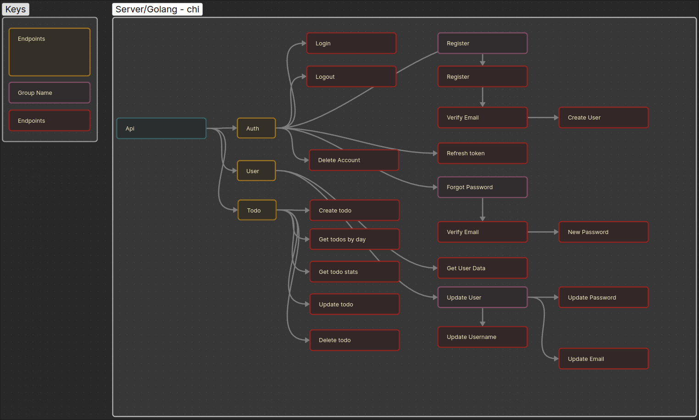

# Todo Application (Flutter/Chi/AWS RDS/AWS EC2 Instance)

## Frontend


### Introduction
For project's frontend I chose [flutter](https://flutter.dev/) as the mobile framework and utilized the [MVVN Architecture](https://docs.flutter.dev/app-architecture/guide) to allow the application to be scaled, tested, and maintained. 

### Packages
- [dio](https://pub.dev/packages/dio) - HTTP client & interceptor
- [flutter_secure_storage](https://pub.dev/packages/flutter_secure_storage) - for token
- [shared_preferences](https://pub.dev/packages/shared_preferences) - user data storage
- [go_router](https://pub.dev/packages/go_router) - app routing and deep linking
- [provider](https://pub.dev/packages/provider) - state management
- [json_annotations](https://pub.dev/packages/json_annotation) - generating models
- [freezed](https://pub.dev/packages/freezed) - generating models
- [intl](https://pub.dev/packages/intl) - localization 

### Features
- [x] Reverse Proxy
- [x] Authentication Middleware
- [x] Rate limiter
- [x] Gracefull Shutdown
- [x] Global Logging
- [x] Mailer

### Requirements
- [x] Mobile framework (Flutter/dart)
- [x] Design architecture (MVVM)
- [x] Integrate backend api
- [x] State management
- [x] Routing
- [x] Documentation

### Folder Structure
```
lib
├── config
│   └── provider.dart
├── data
│   ├── repositories
│   └── services
├── domain
│   └── models
├── l10n
│   └── app_en.arb
├── main.dart
├── router
├── ui
│   ├── auth
│   │   ├── login
│   │   │   ├── view_model
│   │   │   └── widgets
│   │   └── logout
│   ├── core
│   │   └── theme
│   ├── home
│   ├── recover
│   │   ├── recover
│   │   └── update
│   ├── registration
│   │   ├── newuser
│   │   └── registration
│   └── settings
│       ├── nav
│       └── settings
└── utils
```

### How to build
<details>
<summary> Prerequisite </summary>

- [Flutter](https://flutter.dev/)
- [Android Studio](https://developer.android.com/)
- Sdk Version - 35
- ndk Version - 27.0.12077973
- Gradle Version - 8.10.2

</details>

<details>
<summary> Setup </summary>

`
git clone "repo-url"; \
cd "folder"; \
flutter run 
`

</details>

## Backend

### Introduction
For this project I chose [golang](https://go.dev/) as the backend with the [chi framework](https://go-chi.io/). The server connects to a [Postgres Database](https://www.postgresql.org/) hosted on AWS RDS and all logs and traces are sent to a [Grafana Instance](https://grafana.com/) to visualize data for further use. The server is encapsulated using [Docker Compose](https://docs.docker.com/reference/compose-file/) and [Docker](https://docs.docker.com/) and finally a [reverse proxy  Caddy](https://caddyserver.com/) is used to reroute all traffic from the server to port :80. This allows the server to be horizontally scaled using [Docker Swarm](https://docs.docker.com/engine/swarm/) since it is small.   

### Features
- [x] Reverse Proxy
- [x] Authentication Middleware
- [x] Rate limiter
- [x] Gracefull Shutdown
- [x] Global Logging
- [x] Mailer

### Requirements

#### Backend 
- [x] CRUD 
- [x] Authentication
- [x] Deploy to cloud (AWS EC2 Instance)
- [x] Integrate non-local database (AWS RDS)
- [x] Build to scale (Docker)
- [x] Documentation

#### Server 
- [x] AWS EC2 Instance

#### Database
- [x] AWS RDS Database (Postgres 17)

### Endpoints
To view and test endpoint, import [Todo server endpoints](https://github.com/crypticraccoon/nimble/blob/main/docs/Server.postman_collection.json) to postman.

#### Overveiw


### Packages
 - Chi 
 - Cors
 - Httprate
 - uuid
 - jwt
 - pgx
 - godotenv
 - otel
 - gomail
 - crypto

### Folder Structure
```
server/
├── conf
│   └── Caddyfile File
├── database
|	│   
│   └── scripts
│       └── Init scripts 
|     
├── docker-compose.yml
└── todo
    ├── Dockerfile                    - Server build file
    ├── internal                      - Entrance to server
	└── makefile                      - Make script to repetative cmds
       ├── api                        - Endpoints/Api 
       ├── cmd                        - App entrypoint
       ├── confs                      - Config files for all services 
       ├── database                   - Database functions
       ├── errors                     - Custom errors
       ├── logging                    - Global logger 
       ├── mailer                     - Mailer used to send emails
       ├── middlewares                - API Middleware
       ├── models                     - Models
       ├── otel                       - OTEL entrypoint
       ├── response                   - Custom server response templates
       ├── server                     - Server entrypoint
       └── utils                      - Miscellaneous functions
```

### How to build

<details>
<summary> Prerequisite </summary>

- Git
- Docker

</details>

<details>
    <summary> Setup</summary>

To install docker for your machine follow the [instructions here](https://docs.docker.com/engine/install/).

`
apt-get update;
apt-get install git 
`

`
git clone "repo-url"; 
cd "folder" 
`

`
cp .example .env;
docker compose up
`

</details>

